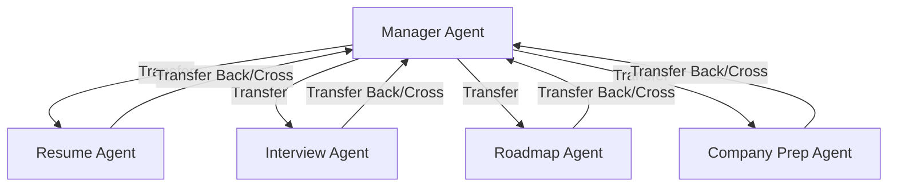

# PlacementPilot AI - Production-Grade Multi-Agent Career & Placement Assistant

PlacementPilot AI is an advanced, production-grade multi-agent system designed to guide candidates through their job search, resume building, ATS optimization, skill gap analysis, interview preparation, and job application tracking. Built using Google's Agent Development Kit (ADK) and Gemini 3.5 Flash, it features a central coordinator (Manager Agent) and four specialized sub-agents with shared session state.

---

## 🌟 Upgraded Production-Grade Features

1. **Placement Readiness Score**: A holistic, weighted readiness score (0-100) combining Resume Quality, ATS Match, Mock Interview Grades, and Completed Milestones.
2. **ATS Resume Analysis**: Performs formatting and keyword analysis on raw resume text against a target job description, identifying formatting issues (tables, columns) and keyword densities.
3. **Skill Gap Analysis**: Identifies critical missing technical and soft skills based on target roles (e.g. Software Engineer, Data Scientist, Product Manager) and target companies.
4. **Student Profile Memory**: Exposes profile management tools allowing agents to read and write candidate details (skills, target role, company, and resume info) dynamically.
5. **Progress & Milestone Tracking**: Tracks completion of key tasks (e.g., Profile Setup, Resume Review, Mock Interview, Roadmap Generation, and Job Tracking).
6. **Job Application Tracker**: A full tracking system supporting adding, listing, and updating job applications and their application status.
7. **Worldwide Company Preparation Guide**: Upgraded `get_company_guide` to provide custom stages, cultural values (e.g., leadership principles, Googliness), and key preparation focus areas for **any company worldwide** (tech, finance, consulting, startups, etc.).

---

## 📐 Agents Architecture



### Specialized Sub-Agents:
1. **Manager Agent (`manager_agent`)**: The entry-point router and coordinator. Welcomes candidates, handles job applications tracker, tracks progress, and calculates placement readiness.
2. **Resume Agent (`resume_agent`)**: The resume & ATS optimization specialist. Analyzes skills, provides ATS compatibility scores, lists missing keywords, and flags layout issues.
3. **Interview Agent (`interview_agent`)**: The mock interviewer. Generates customized role-specific coding, system design, or behavioral questions, evaluates answers, and updates the candidate's interview scores.
4. **Roadmap Agent (`roadmap_agent`)**: The strategic planner. Structures week-by-week technical prep schedules tailored to the candidate's skill gaps and timeline.
5. **Company Prep Agent (`company_prep_agent`)**: The recruiter guidelines expert. Provides recruitment loop details, cultural values, and preparation guides for any company worldwide.

---

## 🛠️ Complete Tools Registry

| Group | Tool Name | Description |
|---|---|---|
| **Profile & Score** | `get_student_profile` | Retrieves current candidate profile state (skills, target role, target company, scores). |
| | `update_student_profile` | Dynamically updates candidate profile information. |
| | `get_placement_readiness_score` | Returns readiness score (0-100) and personalized recommendations. |
| **Resume & ATS** | `analyze_resume` | Analyzes resume skills and experience summary against a target role (baseline review). |
| | `analyze_ats_resume` | Evaluates a raw resume against a job description for keywords and layout formatting. |
| | `analyze_skill_gaps` | Analyzes current skills vs. expected skills for role/company, identifying gaps and suggesting resources. |
| **Mock Interview** | `get_interview_questions` | Generates Mock Interview questions based on role, topic, and difficulty. |
| | `grade_answer` | Grades a candidate's answer (1-10) and provides STAR method feedback. |
| **Roadmap** | `generate_roadmap_details` | Creates week-by-week preparation schedules based on role and target company. |
| **Company Prep** | `get_company_guide` | Provides recruiting guides, key values, and interview stages for any company worldwide. |
| **Job Tracker** | `get_job_tracker` | Lists all tracked job applications and statuses. |
| | `add_job_application` | Adds a new job application (Applied, Interviewing, Offered, etc.). |
| | `update_job_application` | Updates status, notes, or next steps for an existing application. |
| **Progress Tracker**| `get_progress` | Fetches milestones progress and average interview performance. |
| | `complete_progress_milestone`| Manually marks a task milestone on the checklist as completed. |

---

## 📂 Project Directory Structure

```text
placement_pilot/
├── agent.py            # Complete multi-agent definitions & career helper tools
├── __init__.py         # ADK discovery initialization
├── pilot_test.test.json# Updated verification and evaluation cases
├── test_config.json    # Evaluation criteria configuration
├── .env                # API key configuration
└── README.md           # Documentation
```

---

## 🚀 Execution Instructions

### 1. Interactive CLI Mode
Run the multi-agent coordinator inside the terminal:
```powershell
.\.venv\Scripts\adk.exe run placement_pilot
```

### 2. Web UI Mode
Launch a premium local development server with a Web UI dashboard showing real-time agent transfers and tool executions:
```powershell
.\.venv\Scripts\adk.exe web placement_pilot
```
Once started, visit: [http://localhost:8000](http://localhost:8000)

### 3. Evaluation & Testing
To evaluate your agent using the test suite under `pilot_test.test.json`:
```powershell
.\.venv\Scripts\adk.exe eval placement_pilot placement_pilot\pilot_test.test.json --config_file_path placement_pilot\test_config.json --print_detailed_results
```
*(Note: Ensure your Gemini API Key in `.env` has sufficient daily/minute quota limits for the evaluation run.)*
