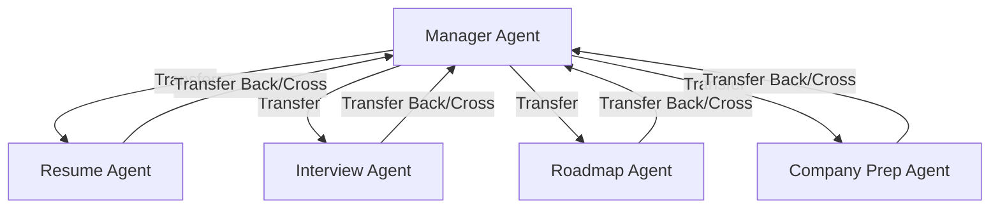

# PlacementPilot AI - Production-Grade Multi-Agent Career & Placement Assistant

PlacementPilot AI is an advanced, production-grade multi-agent system designed to guide candidates through their job search, resume building, ATS optimization, skill gap analysis, interview preparation, and job application tracking. Built using Google's Agent Development Kit (ADK) and Gemini 3.5 Flash, it features a central coordinator (Manager Agent) and four specialized sub-agents with shared session state<div align="center">

# 🚀 PlacementPilot AI
### Production-Grade Multi-Agent Career & Placement Assistant

<p align="center">
An intelligent Multi-Agent AI platform that helps students optimize resumes, prepare for interviews, analyze ATS compatibility, identify skill gaps, generate personalized roadmaps, and track job applications using Google's Agent Development Kit (ADK) and Gemini.
</p>

<p align="center">


</p>

</div>

---

# 📖 Overview

PlacementPilot AI is a production-grade Multi-Agent AI system designed to act as a personal placement mentor for students and job seekers.

Instead of relying on a single AI model, PlacementPilot intelligently routes user requests through specialized AI agents coordinated by a central Manager Agent.

The system assists candidates throughout their placement journey by providing resume analysis, ATS optimization, interview preparation, company-specific guidance, personalized roadmaps, job tracking, and placement readiness evaluation.

Built using **Google ADK** and **Gemini**, the project demonstrates modern AI agent architecture used in real-world applications.

---

# ✨ Key Features

### 📄 Resume Intelligence

- ATS Resume Analysis
- Resume Quality Score
- Resume Improvement Suggestions
- Keyword Optimization
- Formatting Analysis
- Missing Skills Detection

---

### 🎯 Placement Readiness

- Placement Readiness Score (0-100)
- Personalized Recommendations
- Progress Tracking
- Milestone Completion
- Interview Performance Analysis

---

### 🎤 AI Interview Coach

- Role-specific Interview Questions
- Technical Questions
- Behavioral Questions
- STAR Feedback
- Answer Evaluation
- Interview Scoring

---

### 🧠 Student Memory

- Stores Candidate Profile
- Skills
- Target Role
- Target Company
- Resume Details
- Interview Scores

---

### 📚 Learning Roadmaps

Generate personalized preparation plans based on:

- Current Skills
- Target Role
- Target Company
- Timeline
- Skill Gaps

---

### 🏢 Company Preparation

Supports companies worldwide.

Provides:

- Hiring Process
- Interview Stages
- Cultural Values
- Leadership Principles
- Preparation Strategy
- Focus Areas

---

### 💼 Job Application Tracker

Track applications including

- Applied
- OA Scheduled
- Interviewing
- Rejected
- Offered
- Accepted

---

# 🏗️ Multi-Agent Architecture

```text
                         User
                           │
                           ▼
                  🧠 Manager Agent
                           │
        ┌──────────┬──────────┬──────────┬──────────┐
        ▼          ▼          ▼          ▼
 Resume Agent Interview Agent Roadmap Agent Company Prep Agent
        │          │          │          │
        └──────────┴──────────┴──────────┘
                    │
                    ▼
              Final Response
```

---

# 🤖 AI Agents

## 🧠 Manager Agent

Responsible for:

- User Interaction
- Agent Routing
- Session Management
- Placement Readiness
- Progress Tracking
- Job Tracker

---

## 📄 Resume Agent

Responsibilities

- Resume Review
- ATS Compatibility
- Resume Scoring
- Skill Extraction
- Keyword Matching

---

## 🎤 Interview Agent

Responsibilities

- Interview Questions
- Coding Questions
- Behavioral Questions
- Answer Evaluation
- Feedback Generation
- Score Calculation

---

## 🗺️ Roadmap Agent

Creates personalized

- Weekly Study Plans
- Learning Timeline
- Skill Development Plan
- Placement Strategy

---

## 🏢 Company Preparation Agent

Provides

- Hiring Process
- Interview Stages
- Company Culture
- Preparation Tips
- Technical Focus Areas

---

# 🛠️ Complete Tools Registry

| Category | Tool | Description |
|------------|------------|------------|
| Profile | get_student_profile | Retrieve student profile |
| Profile | update_student_profile | Update profile |
| Score | get_placement_readiness_score | Calculate readiness score |
| Resume | analyze_resume | Resume analysis |
| Resume | analyze_ats_resume | ATS analysis |
| Resume | analyze_skill_gaps | Skill gap detection |
| Interview | get_interview_questions | Generate interview questions |
| Interview | grade_answer | Evaluate answers |
| Roadmap | generate_roadmap_details | Personalized roadmap |
| Company | get_company_guide | Company preparation guide |
| Tracker | add_job_application | Add application |
| Tracker | update_job_application | Update application |
| Tracker | get_job_tracker | View applications |
| Progress | get_progress | View progress |
| Progress | complete_progress_milestone | Complete milestones |

---

# ⚙️ Tech Stack

| Category | Technology |
|------------|------------|
| Programming Language | Python |
| AI Framework | Google Agent Development Kit (ADK) |
| LLM | Gemini |
| Environment | Python Virtual Environment |
| Configuration | python-dotenv |
| Version Control | Git + GitHub |

---

# 📂 Project Structure

```
placement_pilot/

├── agent.py
├── __init__.py
├── pilot_test.test.json
├── test_config.json
├── .env
├── README.md
```

---

# 🚀 Getting Started

## Clone Repository

```bash
git clone https://github.com/YOUR_USERNAME/placement-pilot.git

cd placement-pilot
```

---

## Create Virtual Environment

```bash
python -m venv .venv
```

---

## Activate

Windows

```bash
.venv\Scripts\activate
```

Linux / Mac

```bash
source .venv/bin/activate
```

---

## Install Dependencies

```bash
pip install -r requirements.txt
```

---

## Configure Environment

Create `.env`

```env
GOOGLE_API_KEY=YOUR_API_KEY
```

---

# ▶️ Run

CLI Mode

```bash
adk run placement_pilot
```

---

Web Dashboard

```bash
adk web placement_pilot
```

Open

```
http://localhost:8000
```

---

# 🧪 Evaluation

```bash
adk eval placement_pilot placement_pilot/pilot_test.test.json --config_file_path placement_pilot/test_config.json --print_detailed_results
```

---

# 📸 Screenshots

Add screenshots here

- Dashboard
- Resume Analysis
- ATS Score
- Interview Evaluation
- Company Guide
- Job Tracker

---

# 🚀 Future Enhancements

- Resume PDF Export
- Cover Letter Generator
- LinkedIn Profile Analyzer
- AI Email Writer
- Voice Interview
- RAG Knowledge Base
- Multi-language Support
- Streamlit Frontend
- Docker Deployment
- Cloud Deployment
- Authentication
- Analytics Dashboard

---

# 💡 Why PlacementPilot AI?

Unlike traditional chatbots, PlacementPilot AI uses a **Multi-Agent Architecture**, allowing specialized AI agents to solve specific career-related tasks collaboratively.

This architecture improves:

- Scalability
- Maintainability
- Task Specialization
- Better User Experience
- Production Readiness

---

# 🤝 Contributing

Contributions are welcome!

Feel free to fork the repository, improve the project, and submit a Pull Request.

---

# 👨‍💻 Author

## Humerah Vahora

AI Engineer | Generative AI Developer | Multi-Agent AI Enthusiast

---

# ⭐ Show Your Support

If you found this project useful, please consider giving it a ⭐ on GitHub.

It motivates further development and helps others discover the project.

---.

---

## 🌟 Upgraded Production-Grade Features

1. **Placement Readiness Score**: A holistic, weighted readiness score (0-100) combining Resume Quality, ATS Match, Mock Interview Grades, and Completed Milestones.
2. **ATS Resume Analysis**: Performs formatting and keyword analysis on raw resume text against a target job description, identifying formatting issues (tables, columns) and keyword densities.
3. **Skill Gap Analysis**: Identifies critical missing technical and soft skills based on target roles (e.g. Software Engineer, Data Scientist, Product Manager) and target companies.
4. **Student Profile Memory**: Exposes profile management tools allowing agents to read and write candidate details (skills, target role, company, and resume info) dynamically.
5. **Progress & Milestone Tracking**: Tracks completion of key tasks (e.g., Profile Setup, Resume Review, Mock Interview, Roadmap Generation, and Job Tracking).
6. **Job Application Tracker**: A full tracking system supporting adding, listing, and updating job applications and their application status.
7. **Worldwide Company Preparation Guide**: Upgraded `get_company_guide` to provide custom stages, cultural values (e.g., leadership principles, Googliness), and key preparation focus areas for **any company worldwide** (tech, finance, consulting, startups, etc.).

---

## 📐 Agents Architecture



### Specialized Sub-Agents:
1. **Manager Agent (`manager_agent`)**: The entry-point router and coordinator. Welcomes candidates, handles job applications tracker, tracks progress, and calculates placement readiness.
2. **Resume Agent (`resume_agent`)**: The resume & ATS optimization specialist. Analyzes skills, provides ATS compatibility scores, lists missing keywords, and flags layout issues.
3. **Interview Agent (`interview_agent`)**: The mock interviewer. Generates customized role-specific coding, system design, or behavioral questions, evaluates answers, and updates the candidate's interview scores.
4. **Roadmap Agent (`roadmap_agent`)**: The strategic planner. Structures week-by-week technical prep schedules tailored to the candidate's skill gaps and timeline.
5. **Company Prep Agent (`company_prep_agent`)**: The recruiter guidelines expert. Provides recruitment loop details, cultural values, and preparation guides for any company worldwide.

---

## 🛠️ Complete Tools Registry

| Group | Tool Name | Description |
|---|---|---|
| **Profile & Score** | `get_student_profile` | Retrieves current candidate profile state (skills, target role, target company, scores). |
| | `update_student_profile` | Dynamically updates candidate profile information. |
| | `get_placement_readiness_score` | Returns readiness score (0-100) and personalized recommendations. |
| **Resume & ATS** | `analyze_resume` | Analyzes resume skills and experience summary against a target role (baseline review). |
| | `analyze_ats_resume` | Evaluates a raw resume against a job description for keywords and layout formatting. |
| | `analyze_skill_gaps` | Analyzes current skills vs. expected skills for role/company, identifying gaps and suggesting resources. |
| **Mock Interview** | `get_interview_questions` | Generates Mock Interview questions based on role, topic, and difficulty. |
| | `grade_answer` | Grades a candidate's answer (1-10) and provides STAR method feedback. |
| **Roadmap** | `generate_roadmap_details` | Creates week-by-week preparation schedules based on role and target company. |
| **Company Prep** | `get_company_guide` | Provides recruiting guides, key values, and interview stages for any company worldwide. |
| **Job Tracker** | `get_job_tracker` | Lists all tracked job applications and statuses. |
| | `add_job_application` | Adds a new job application (Applied, Interviewing, Offered, etc.). |
| | `update_job_application` | Updates status, notes, or next steps for an existing application. |
| **Progress Tracker**| `get_progress` | Fetches milestones progress and average interview performance. |
| | `complete_progress_milestone`| Manually marks a task milestone on the checklist as completed. |

---

## 📂 Project Directory Structure

```text
placement_pilot/
├── agent.py            # Complete multi-agent definitions & career helper tools
├── __init__.py         # ADK discovery initialization
├── pilot_test.test.json# Updated verification and evaluation cases
├── test_config.json    # Evaluation criteria configuration
├── .env                # API key configuration
└── README.md           # Documentation
```

---

## 🚀 Execution Instructions

### 1. Interactive CLI Mode
Run the multi-agent coordinator inside the terminal:
```powershell
.\.venv\Scripts\adk.exe run placement_pilot
```

### 2. Web UI Mode
Launch a premium local development server with a Web UI dashboard showing real-time agent transfers and tool executions:
```powershell
.\.venv\Scripts\adk.exe web placement_pilot
```
Once started, visit: [http://localhost:8000](http://localhost:8000)

### 3. Evaluation & Testing
To evaluate your agent using the test suite under `pilot_test.test.json`:
```powershell
.\.venv\Scripts\adk.exe eval placement_pilot placement_pilot\pilot_test.test.json --config_file_path placement_pilot\test_config.json --print_detailed_results
```
*(Note: Ensure your Gemini API Key in `.env` has sufficient daily/minute quota limits for the evaluation run.)*
